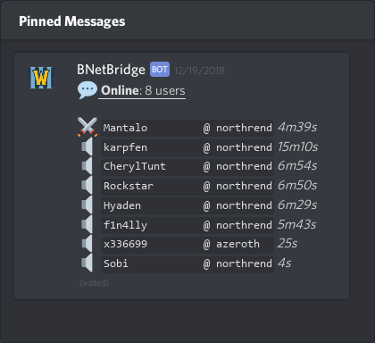
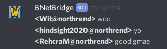
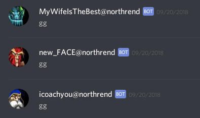

Discord
=======

Goop can connect to one or multiple gateways. Add a configuration section to [`config.toml`](/config.md) for each gateway.


Config
------

Get an [authorization token and channel ID](https://github.com/Chikachi/DiscordIntegration/wiki/How-to-get-a-token-and-channel-ID-for-Discord) to connect to Discord.

_Default config:_
```toml
[Discord.Default]
  AccessDM = "ignore"
  AuthToken = ""
  Presence = "Battle.net"
  AccessUser = {}

[Discord.ChannelDefault]
  AccessMentions = "whitelist"
  AccessTalk = "voice"
  BufSize = 64
  RelayJoins = ""
  Webhook = ""
  AccessRole = {}
  AccessUser = {}
```

_Example:_
```toml
[Discord.Gateways.Bridge]
  AuthToken = "000000000000000000000000.000000.000000000000000000000000000"

  [Discord.Gateways.Bridge.Channels.000000000000000000]
    AccessUser = { 193313355237294080 = "owner" }
```

?> **TIP:** Enable Discord developer mode (User Settings > Appearance) to get a "Copy ID" option in your right-click menu.


User List
---------

  
_Online user list on Discord, viewed via Pinned Messages._

On Discord, it is possible to continously update a single message with the online user list.  
To enable this feature, set `RelayJoins` to `"List"` and relay joins to the gateway.

?> **TIP:** Pin the online user list to make it easily accessible at all times.

_Example config:_
```toml
[Discord.Gateways.Bridge]
  AuthToken = "000000000000000000000000.000000.000000000000000000000000000"

  [Discord.Gateways.Bridge.Channels.000000000000000000]
    AccessUser = { 193313355237294080 = "owner" }
    RelayJoins = "list"

[Relay.To."discord:Bridge:000000000000000000".Default]
  Joins       = true
  Say         = true
  Chat        = true
  JoinAccess  = "min"
  ChatAccess  = "voice"
```


Webhook
-------

By default, a Discord gateway will relay messages from other gateways through the bot account. However, webhooks make it possible to customize forwarded messages with a proper name and icon. To enable webhooks, create a [Discord webhook](https://support.discordapp.com/hc/en-us/articles/228383668-Intro-to-Webhooks) and update the `Webhook` setting.

!> **NOTE:** The official Battle.net API does not provide icon info, so this feature will only work properly with unofficial Battle.net servers.

  
_Relaid messages without webhooks (default)._

  
_Relaid messages with webhooks._ 
